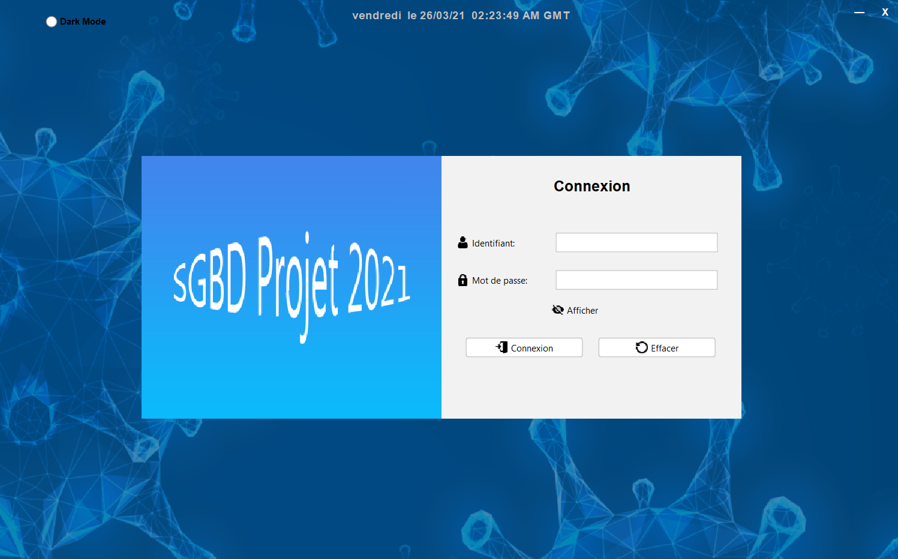
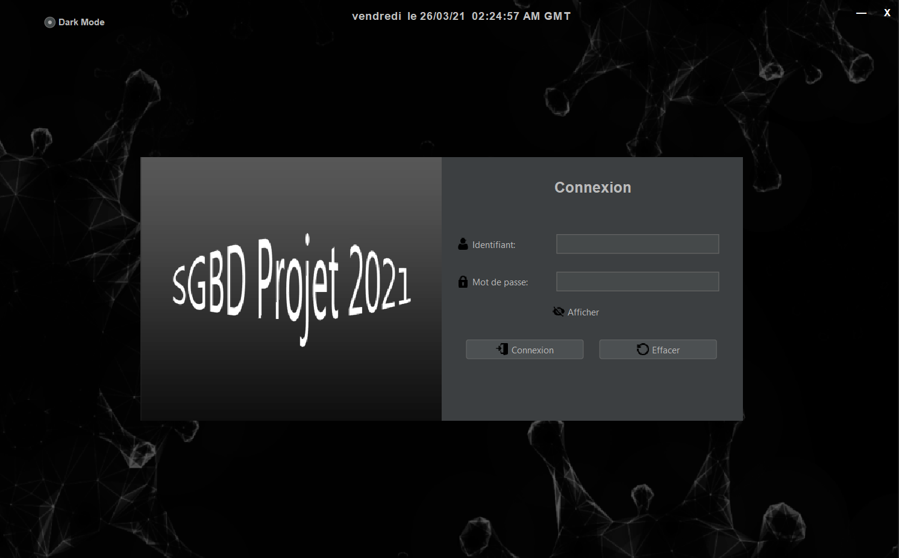
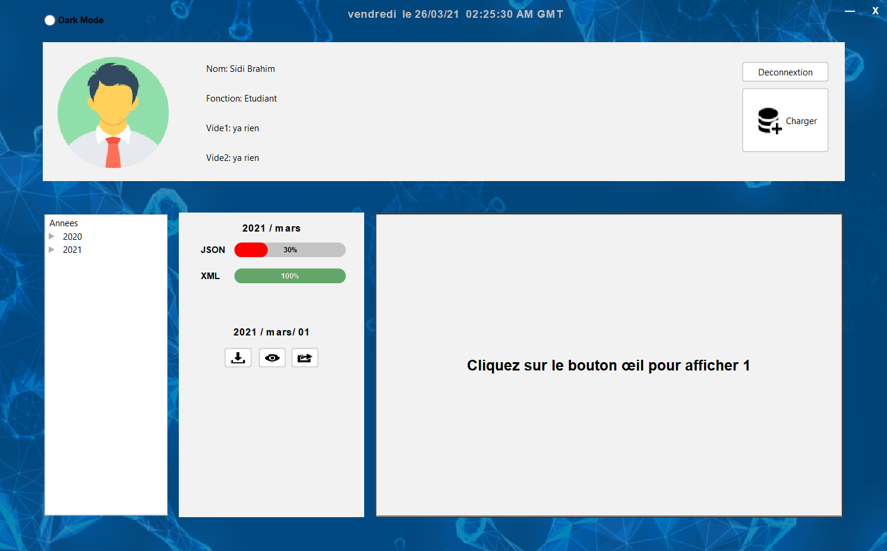
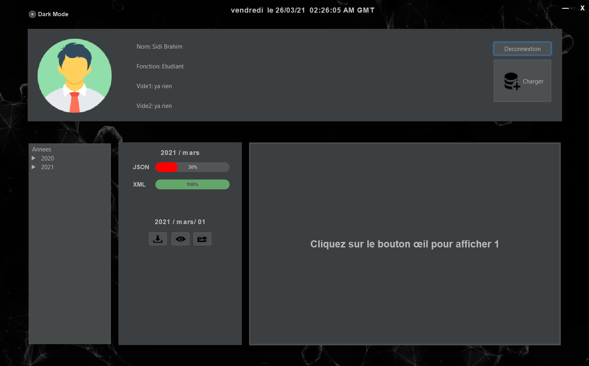
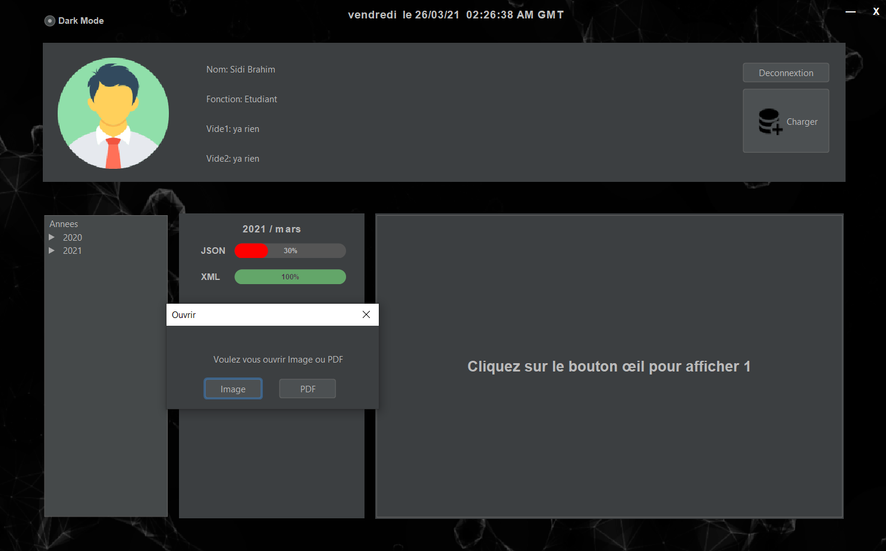
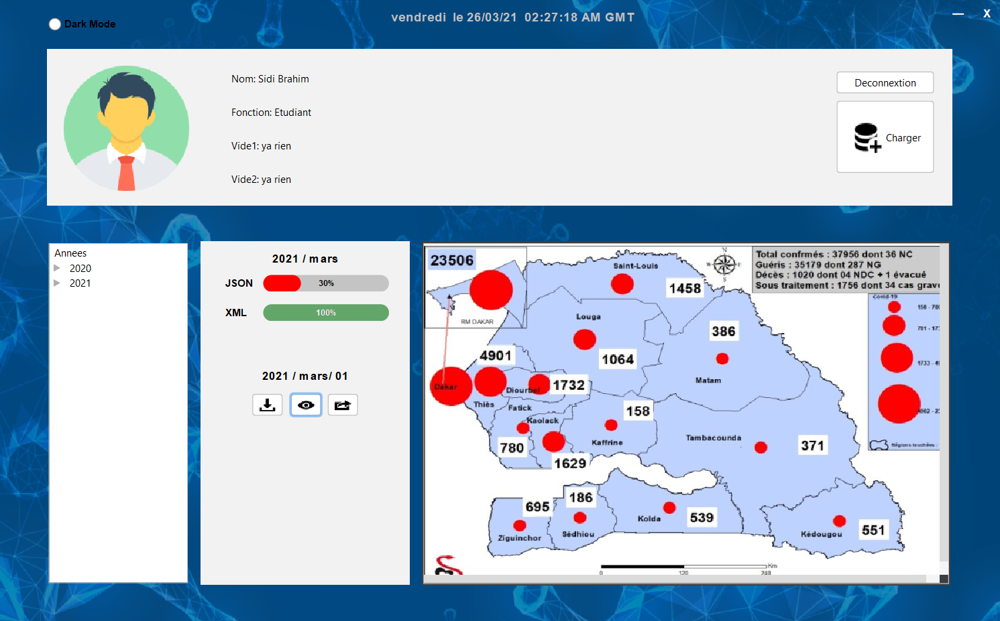
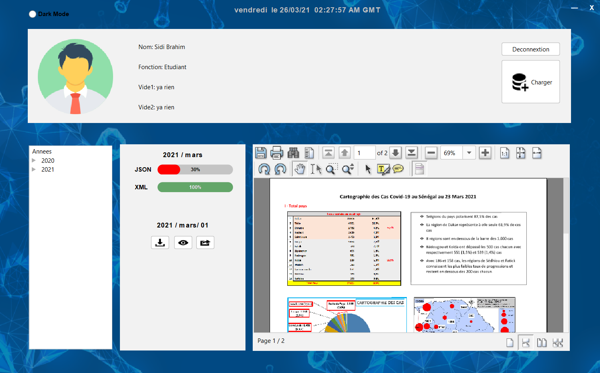

# Fichier jar
* #### Pour lancer le fichier jar
```batch
java -jar app.jar
```
* ### Pour obtenir les fichiers stockés dans le fichier .JAR

```batch
jar xf app.jar
```
# Fichier executable
##### Il fonctionne comme n'importe quel programme (Clicker deux fois)

# Forme générale

1. Page de Connexion (Light Mode)
 


2. Page de Connexion (Dark Mode)




3. Page de Controle (Light Mode)



4. Page de Controle (Dark Mode)



1. Le choix est entre Image ou PDF



3. Affichage des Images



7. Affichage de PDF



